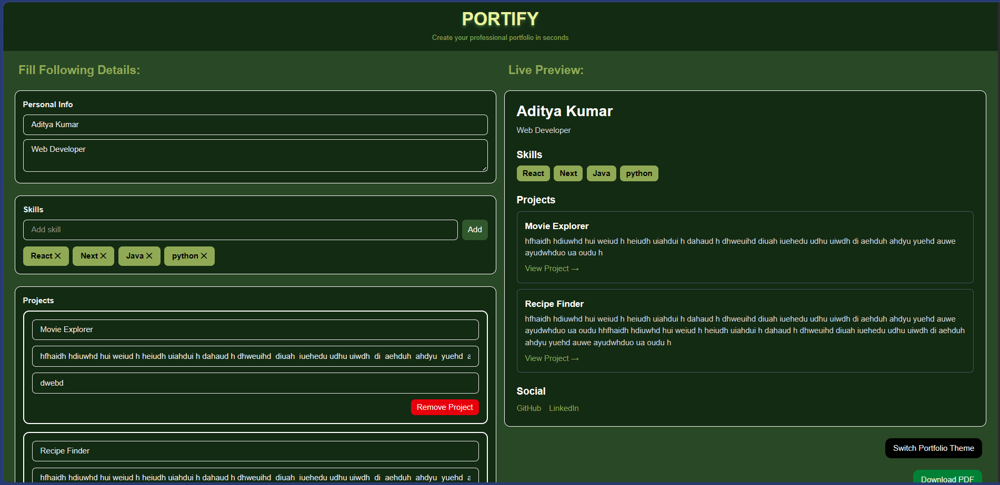

# 🚀 Portify – Dev Portfolio Builder

A modern web app to create and preview developer portfolios in real-time, with theme customization and PDF export.

---

## ✨ Features

- 🧾 **Live Preview**  
  See your portfolio update instantly as you type.

- 🎨 **Theme Switching**  
  Switch between different portfolio themes (light/dark).

- 📂 **Dynamic Projects Section**  
  Add, edit, and remove multiple projects easily.

- 🛠 **Skills Management**  
  Add/remove skills with a clean UI.

- 🔗 **Social Links Integration**  
  Add GitHub and LinkedIn links.

- 📄 **Download as PDF**  
  Export your portfolio as a ready-to-share PDF.

---

## 🧱 Tech Stack

- **Frontend:** Next.js 
- **Styling:** Tailwind CSS
- **PDF Generation:** html-to-image + jsPDF
- **State Management:** React useState

---

## 📸 Screenshots



---

## ⚙️ Installation & Setup

```bash
# Clone the repo
git clone https://github.com/your-username/portify.git

# Navigate to project folder
cd portify

# Install dependencies
npm install

# Run development server
npm run dev